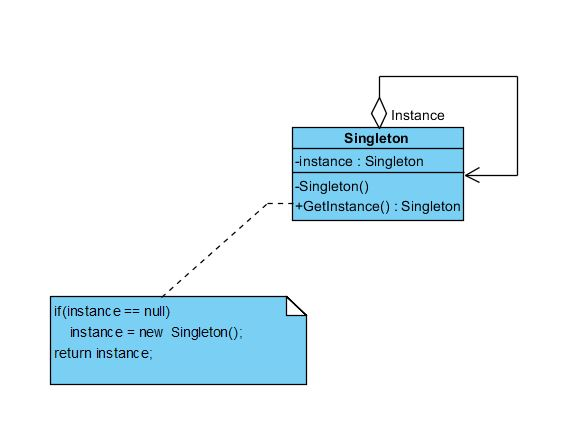

###Check list
- Define a private static attribute in the "single instance" class.
- Define a public static accessor function in the class.
- Do "lazy initialization" (creation on first use) in the accessor function.
- Define all constructors to be protected or private.
- Clients may only use the accessor function to manipulate the Singleton.
